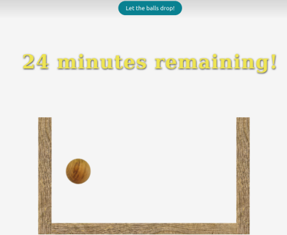

## Pomodoro style time tracker

Short solo project which visualises the Pomodoro technique. The Pomodoro technique traditionally splits tasks into 25 minute sections and aids with time boxing. When the timer is started, a wooden ball will drop into a bucket. Each consecutive ball represents 1 minute that has passed. When the gong sounds, the 25 minute period is up and the bucket is full.

## Motivation

I was motivated to do this project after thinking about ways to visualise time that has passed. I think that being able to "see" the time represented as objects is a nice way to track tasks and aid focus. I also wanted to explore matter.js and incorporated it into the project. 

## Build status

<b>Currently deployed </b>
- [Time Tracker](https://time-tracker-lake.now.sh)

## Screenshots

## Tech used

[matter.js](https://brm.io/matter-js)

## Setup
To run this project, fork and git clone to your directory.
Open index.html to run.

or .... click [Time Tracker](https://time-tracker-lake.now.sh)

# Helpful links

- https://en.wikipedia.org/wiki/Pomodoro_Technique
- [matter.js](https://brm.io/matter-js)

